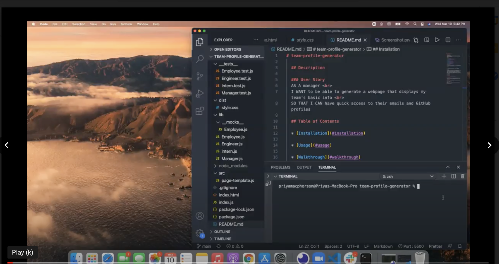
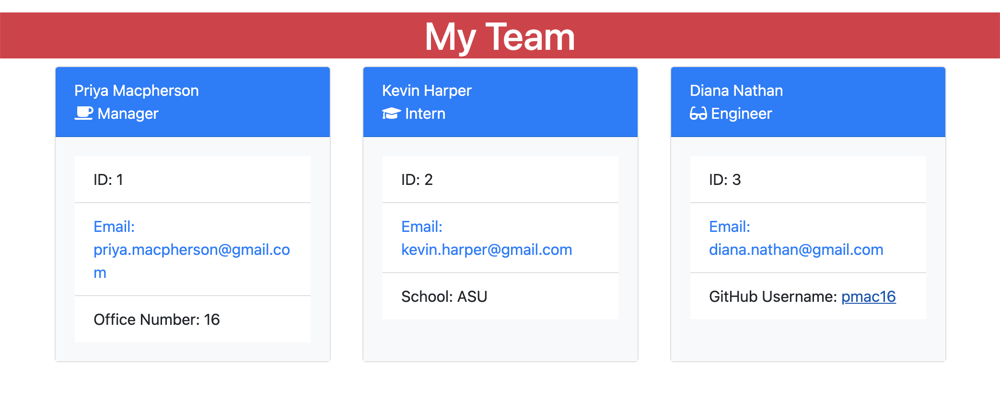

# team-profile-generator

  ## Description
  
  ### User Story
  AS A manager <br>
  I WANT to be able to generate a webpage that displays my team's basic info <br>
  SO THAT I CAN have quick access to their emails and GitHub profiles

  ## Table of Contents

  * [Installation](#installation)

  * [Usage](#usage)

  * [Walkthrough](#walkthrough)

  * [Screenshot](#screenshot)

  * [Contribution](#contribution)

  * [Questions](#questions)

  ## Installation

  To install necessary dependencies, run the following command:

  ```
  npm install
  ```

  This application uses the Inquirer and Jest packages.

  ## Usage

  As a manager, keeping track of all of my employee's information can be challenging. This command-line application allows managers to input team member information. After, an HTML file is generated that displays the information in an easy-to-read format. If a manager/user clicks an email address, then the default email program opens. If a manager/user clicks the GitHub username, then the GitHub profile opens in a new tab. 

  ## Walkthrough
  
  
  A walkthrough video showing how this application works can be found [here](https://drive.google.com/file/d/1qPJOJ73JSTpvEy3nwU5NqgUcrFPSHXgQ/view).

  ## Screenshot 

  

  ## Contribution 

  All contributions are welcome. Please visit the [issues](https://github.com/pmac16/README-generator/issues) tab  to contribute.

  ## Questions

  If you have additional questions, please email me at priya.macpherson@gmail.com.

  Connect with me on GitHub! : [pmac16](https://github.com/pmac16)

### ©️Priya Macpherson

